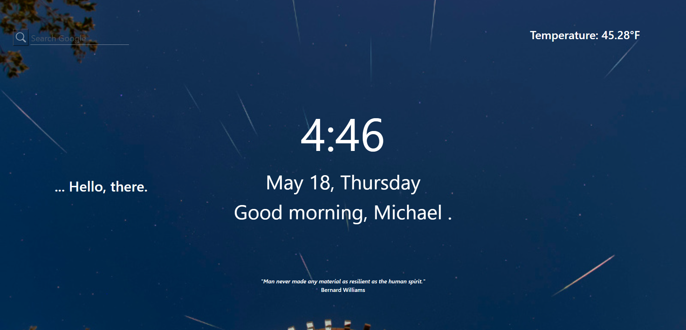
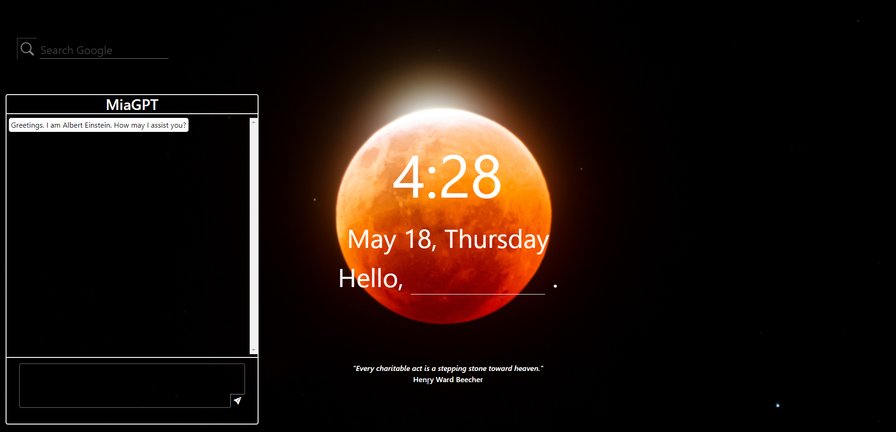

# Simple Start Page

## Description

Welcome to your personalized web browser start page designed to launch you into your day!

## Table of Contents

* [Features](#features)
* [Screenshots](#screenshots)
* [Links](#links)
* [Technologies Used](#technologies-used)
* [Credits](#credits)
* [License](#license)

## Features

* Google Search Bar 
* Weather Forecast
* Motivational Quote
* Customizable Background
* Live Clock
* AI Assistant
* News Headlines (under development)
* To-Do List (under development)

## Screenshots

## Links

Page published at https://mtan1230.github.io/simple-start-page/

## Technologies Used

      

## Credits  

### Collaborators

* [Erik Feeney](https://github.com/erikfeeney)
* [Susan Sprague](https://github.com/susansprague)

### Acknowledgments

* [freeCodeCamp.org](https://www.youtube.com/@freecodecamp)
* [zerotocoding](https://www.youtube.com/@zerotocoding)

## License

